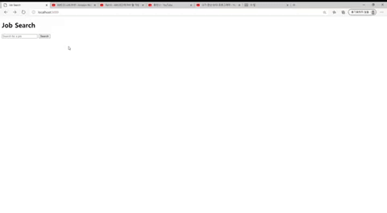

# 사용기술
### Front-End
• JavaScript
### Back-End
• Java &nbsp;&nbsp;&nbsp;&nbsp;&nbsp; • PHP &nbsp;&nbsp; • Python
### Database
• Mysql &nbsp;&nbsp; • Ms-sql

# 프로젝트

## Recycle-Box

(이미지를 클릭하면 해당 프로젝트로 이동합니다)

- 자동 분리수거 쓰레기통
- 아두이노와 파이썬을 이용해 개발
- yolov5 딥러닝 모델 이용

## Seadog_Home

(이미지를 클릭하면 해당 프로젝트로 이동합니다)

- 개인 웹서버
- PHP를 이용해 개발
- Javascript를 이용해 Breakout 게임 및 랭킹 시스템 구현

## Job_Scrapper

(이미지를 클릭하면 해당 프로젝트로 이동합니다)

- 채용공고를 스크랩하는 웹 서버
- Python의 flask 웹 프레임워크를 이용해 서버 구성
- Beatiful Soup를 이용해 정보 추출

<!--
**SSeadog/SSeadog** is a ✨ _special_ ✨ repository because its `README.md` (this file) appears on your GitHub profile.

Here are some ideas to get you started:

- 🔭 I’m currently working on ...
- 🌱 I’m currently learning ...
- 👯 I’m looking to collaborate on ...
- 🤔 I’m looking for help with ...
- 💬 Ask me about ...
- 📫 How to reach me: ...
- 😄 Pronouns: ...
- ⚡ Fun fact: ...
-->
